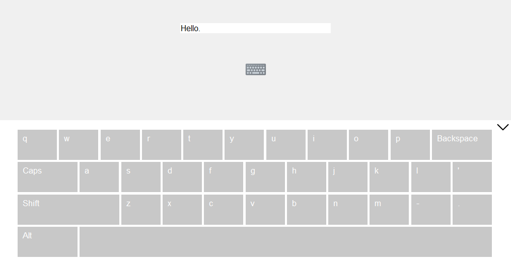

# On-screen keyboard

## About

Author: Jakub Przepiórka

Coding: Python 3.10

Usage: GUI in Tkinter

## Description

Small on-screen keyboard without some buttons.
This keyboard supports entering Polish characters and
passes output directly to the given tkinter.Entry.
This virtual keyboard is sized for use on a 7' display.

You can display or hide keyboard.

